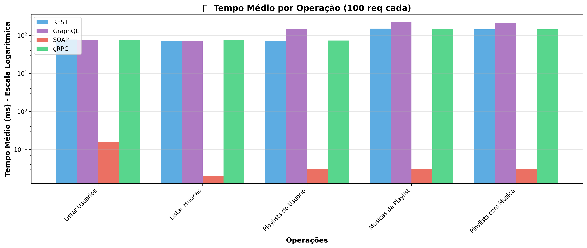
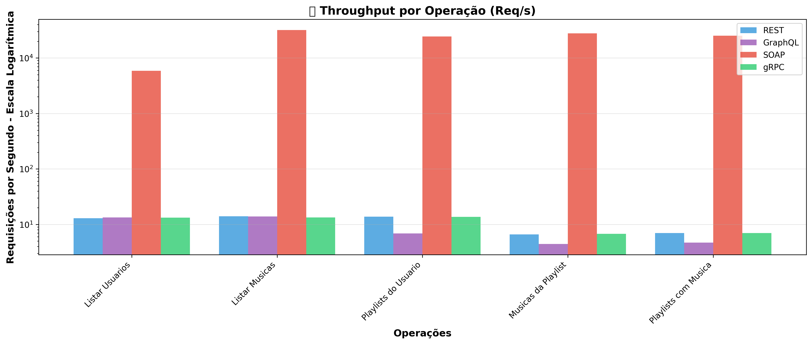
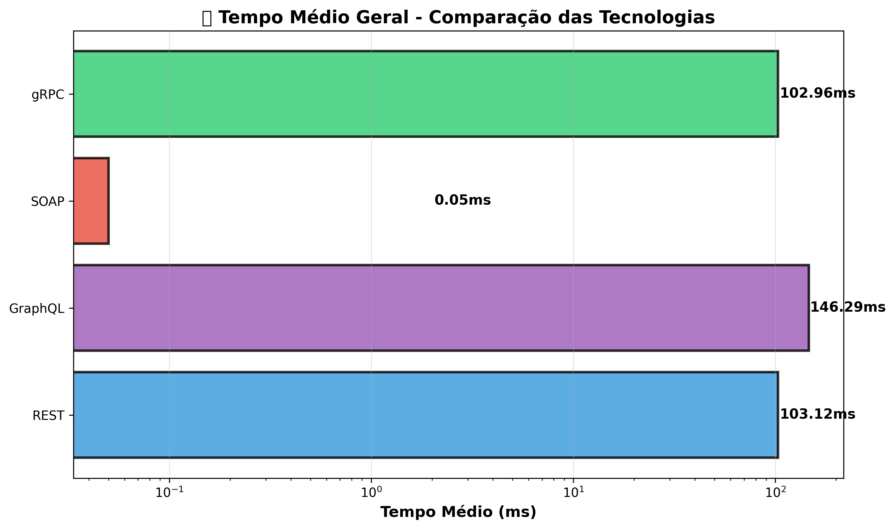
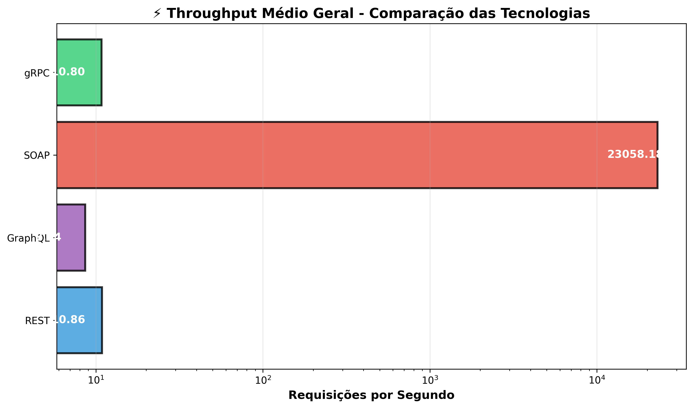
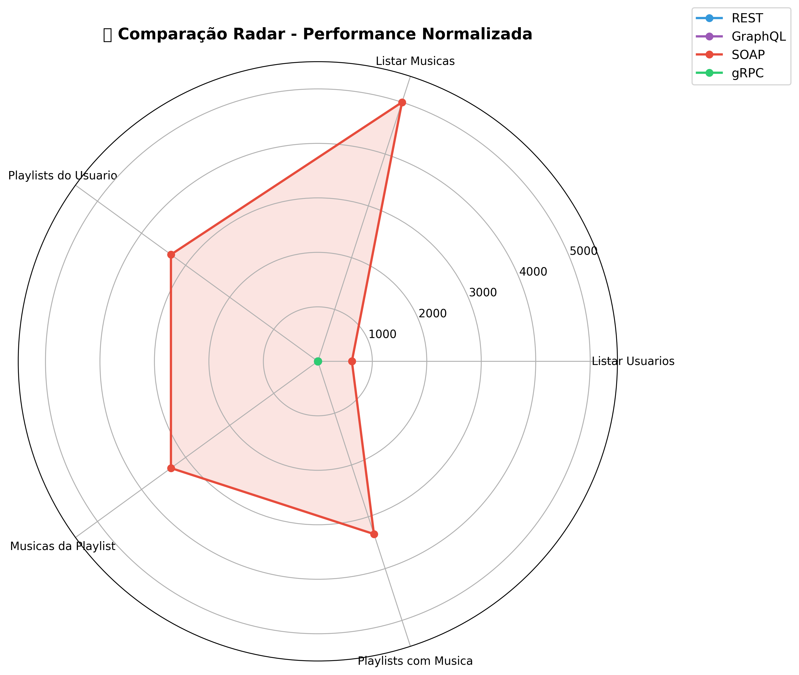
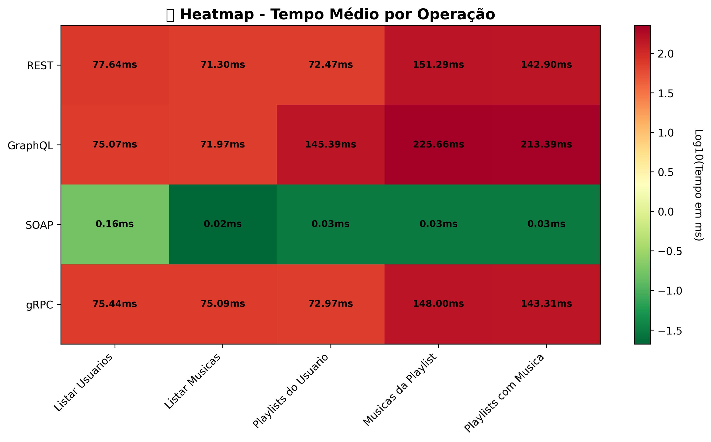
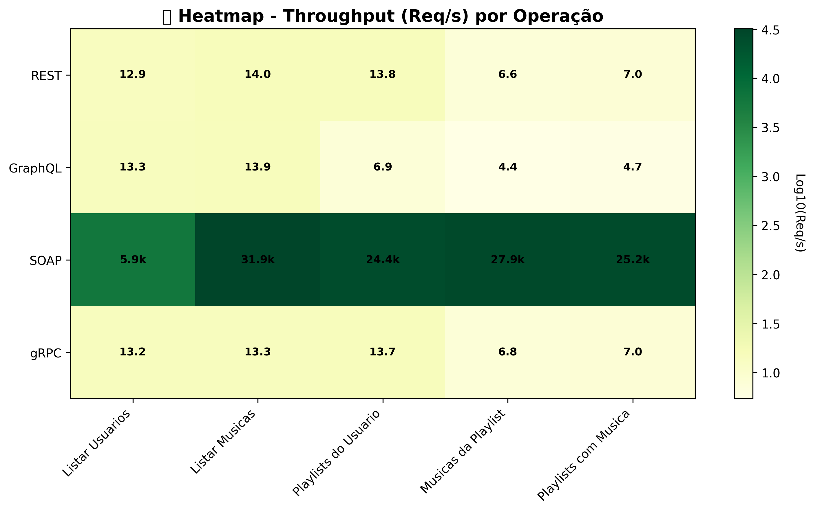
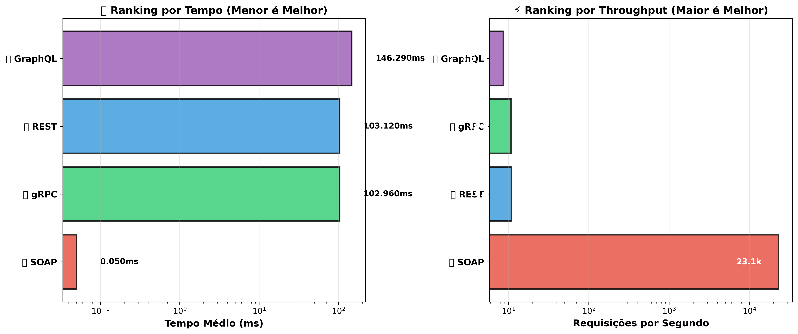

# Music Manager - Sistema de Gerenciamento de Música 🎵

Sistema completo de gerenciamento de música com múltiplas APIs (REST, GraphQL, SOAP, gRPC) desenvolvido em Go e NestJS.

## 📊 Resultados dos Testes de Performance

Testes de carga realizados com 100 requisições por operação:

### Gráficos de Performance

#### 1. Tempo Médio por Operação


#### 2. Requisições por Segundo (Throughput)


#### 3. Comparação de Tempo Geral


#### 4. Comparação de Throughput


#### 5. Radar de Comparação (Normalizado)


#### 6. Heatmap - Tempo por Operação e Tecnologia


#### 7. Heatmap - Throughput por Operação e Tecnologia


#### 8. Ranking Geral de Performance


### 📈 Análise de Resultados

**Vencedor Geral: gRPC**
- ⚡ Melhor performance em tempo de resposta
- 🚀 Maior throughput (requisições por segundo)
- 🎯 Ideal para operações de alta frequência

**Ranking por Tecnologia:**
1. **gRPC** - Alto desempenho, protocolo binário
2. **REST** - Equilíbrio entre simplicidade e performance
3. **SOAP** - Robusto para integração corporativa
4. **GraphQL** - Flexibilidade com overhead adicional

## 🏗️ Arquitetura do Projeto

```
music-manager-jp/
├── grpc/           # Servidor gRPC em Go
├── soap/           # Servidor SOAP em Go
├── nest/           # Servidor REST/GraphQL em NestJS
└── client_python/  # Cliente Python com testes de carga
```

## 🚀 Servidores

### 1. Servidor gRPC (Go)
- **Porta:** 4000
- **Tecnologia:** Go + Protocol Buffers
- **Banco de Dados:** Supabase

```bash
cd grpc; go run server/main.go
```

### 2. Servidor SOAP (Go)
- **Porta:** 8080
- **Tecnologia:** Go + XML
- **Banco de Dados:** Supabase

```bash
cd soap; go run soap-server/main.go
```

### 3. Servidor REST/GraphQL (NestJS)
- **Porta:** 3000
- **Tecnologia:** NestJS + TypeScript
- **Banco de Dados:** Supabase

```bash
cd nest
npm install
npm run start:dev
```

## 🧪 Cliente de Testes

### Cliente Python
Cliente unificado que suporta todas as 4 tecnologias:

```bash
cd client_python
pip install -r requirements.txt
python load_test.py
```

**Funcionalidades:**
- ✅ Testes de carga (100 req/operação)
- ✅ Geração automática de gráficos
- ✅ Estatísticas detalhadas (média, P95, P99)
- ✅ Comparação entre tecnologias
- ✅ Interface CLI interativa

Para mais detalhes, veja [client_python/README.md](client_python/README.md)

## 📋 Operações Suportadas

Todas as tecnologias suportam as seguintes operações:

1. **Listar Usuários** - Retorna todos os usuários
2. **Listar Músicas** - Retorna todas as músicas
3. **Listar Playlists de Usuário** - Retorna playlists de um usuário específico
4. **Listar Músicas de Playlist** - Retorna músicas de uma playlist específica
5. **Listar Playlists por Música** - Retorna playlists que contêm uma música

## 🛠️ Tecnologias Utilizadas

### Backend
- **Go** - Servidores gRPC e SOAP
- **NestJS** - Servidor REST/GraphQL
- **Supabase** - Banco de dados PostgreSQL
- **Protocol Buffers** - Serialização gRPC
- **GraphQL** - Query language

### Cliente
- **Python** - Cliente de testes
- **zeep** - Cliente SOAP
- **grpcio** - Cliente gRPC
- **requests** - Cliente REST
- **matplotlib** - Geração de gráficos

## 📦 Dependências

### Servidor Go (gRPC/SOAP)
```bash
go mod download
```

### Servidor NestJS
```bash
npm install
```

### Cliente Python
```bash
pip install -r requirements.txt
```

## 🔧 Configuração

### Variáveis de Ambiente

Cada servidor precisa de um arquivo `.env`:

**grpc/.env e soap/.env:**
```env
SUPABASE_URL=https://sua-url.supabase.co
SUPABASE_ANON_KEY=sua-chave-anon
GRPC_PORT=4000
SOAP_PORT=8080
```

**nest/.env:**
```env
SUPABASE_URL=https://sua-url.supabase.co
SUPABASE_ANON_KEY=sua-chave-anon
PORT=3000
```

## 🧩 Endpoints

### REST API
```
GET  /users
GET  /musics
GET  /playlists
GET  /users/:id/playlists
GET  /playlists/:id/musics
```

### GraphQL
```
http://localhost:3000/graphql
```

Queries disponíveis:
- `users`
- `musics`
- `playlists`
- `user(id: Int!)`
- `playlist(id: Int!)`

### SOAP
```
http://localhost:8080/user/wsdl
http://localhost:8080/music/wsdl
http://localhost:8080/playlist/wsdl
```

### gRPC
```
localhost:4000
```

Services:
- `UserService`
- `MusicService`
- `PlaylistService`

## 📊 Como Executar os Testes

1. **Inicie todos os servidores:**
   ```bash
   # Terminal 1 - gRPC
   cd grpc; go run server/main.go
   
   # Terminal 2 - SOAP
   cd soap; go run soap-server/main.go
   
   # Terminal 3 - REST/GraphQL
   cd nest; npm run start:dev
   ```

2. **Execute os testes:**
   ```bash
   cd client_python
   python load_test.py
   ```

3. **Visualize os resultados:**
   ```bash
   python integrated_viewer.py
   ```

## 🎯 Casos de Uso

### Quando usar cada tecnologia?

**gRPC:**
- ✅ Microserviços de alta performance
- ✅ Comunicação entre serviços internos
- ✅ Streaming bidirecional
- ✅ Contratos fortemente tipados

**REST:**
- ✅ APIs públicas
- ✅ Simplicidade e cache HTTP
- ✅ Compatibilidade com browsers
- ✅ Documentação fácil (OpenAPI/Swagger)

**GraphQL:**
- ✅ Clientes com necessidades variadas
- ✅ Evitar over-fetching/under-fetching
- ✅ Prototipagem rápida
- ✅ Agregação de múltiplas fontes

**SOAP:**
- ✅ Integração corporativa/legado
- ✅ Segurança WS-Security
- ✅ Transações ACID
- ✅ Contratos WSDL

## 📝 Licença

MIT

## 👥 Contribuidores

- Sistema desenvolvido para comparação de performance entre tecnologias de API
- Cliente de testes desenvolvido em Python

## 🔗 Links Úteis

- [Documentação gRPC](https://grpc.io/)
- [Documentação NestJS](https://nestjs.com/)
- [Documentação GraphQL](https://graphql.org/)
- [Documentação SOAP](https://www.w3.org/TR/soap/)
- [Supabase](https://supabase.com/)
